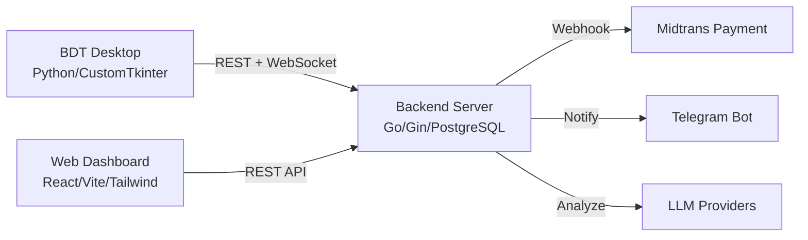

  

<h1 align="center">🤖 Welcome to OtakAtik Robotics</h1>

  <strong>Building the Future of Education through Robotic Interaction &amp; Artificial Intelligence</strong>

  <a href="https://projectidek.dev">🌐 Website</a> &nbsp;•&nbsp;
  <a href="#-featured-project">🚀 Project</a> &nbsp;•&nbsp;
  <a href="#-repositories">📦 Repositories</a> &nbsp;•&nbsp;
  <a href="#-tech-stack">🛠️ Tech Stack</a> &nbsp;•&nbsp;
  <a href="#-contact">📬 Contact</a>

 

---

## 💡 About Us

We are a technology initiative driven by **Computer Engineering** students at **Politeknik Elektronika Negeri Surabaya (PENS)**, under the guidance of **Adnan Rachmat Anom Besari S.ST., M.Sc., Ph.D.**

**OtakAtik Robotics** focuses on developing interactive robotic systems for education. We combine **Computer Vision**, **Artificial Intelligence**, and **Gamification** to create engaging learning experiences and cognitive assessments for children and students.

> 🧒 Ages 3+ &nbsp;|&nbsp; 🏫 All education levels &nbsp;|&nbsp; 🧠 YOLO + MediaPipe + LLM-powered

 

---

## 🚀 Featured Project

### 🧩 Otak Atik Merah Putih (OAMP)

An automated cognitive and dexterity analysis system built on interactive robotic gameplay.

<table>
<tr>
<td width="50%">

**🎮 Block Design Test (BDT) — Desktop Client**
- CustomTkinter native GUI application
- Real-time hand detection via YOLO &amp; MediaPipe
- ESP32 physical button integration
- Multiplayer duel &amp; tournament cup mode
- Offline-capable with fire-and-forget API sync

</td>
<td width="50%">

**🌐 Web Dashboard + REST API**
- React 19 admin panel with real-time leaderboard
- Midtrans (QRIS) payment gateway
- AI-powered health reports via multi-provider LLM
- Telegram bot notifications on payment settlement
- PostgreSQL + websocket duel match spectating

</td>
</tr>
</table>

 

---

## 📦 Repositories

 

| Repo | Status | Description |
|------|--------|-------------|
| 🔓 **[oamp-bdt-dekstop-app-python](https://github.com/OtakAtik-Robotics/oamp-bdt-dekstop-app-python)** | `Public` | Desktop game client — YOLO hand detection, MediaPipe tracking, tournament cup mode |
| 🔒 **oamp-backend** | `Private` | Golang/Gin core server — CRUD, WebSocket duels, Midtrans webhooks, LLM health reports |
| 🔒 **oamp-frontend** | `Private` | React 19 + Vite 8 dashboard — leaderboard, tournaments, AI report Markdown rendering |

 

  

 

---

## 🛠️ Tech Stack

<table align="center">
<tr>
<td align="center" width="25%">

### 🧠 Edge AI &amp; Robotics

</td>
<td align="center" width="25%">

### ⚙️ Backend

</td>
<td align="center" width="25%">

### 🎨 Frontend

</td>
<td align="center" width="25%">

### 🚀 DevOps &amp; Infra

</td>
</tr>
</table>

 

---

## 📬 Contact &amp; Demo

| | |
|---|---|
| 🌐 **Dashboard** | [projectidek.dev](https://projectidek.dev) |
| 📧 **Email** | [root@ce.student.pens.ac.id](mailto:root@ce.student.pens.ac.id) |
| 🏫 **Institution** | Politeknik Elektronika Negeri Surabaya |

 

   
  <em>"Why use many word when few do trick." — The Dev Team 🪨🔥</em>
    
  © 2026 OtakAtik Robotics — PENS Computer Engineering

